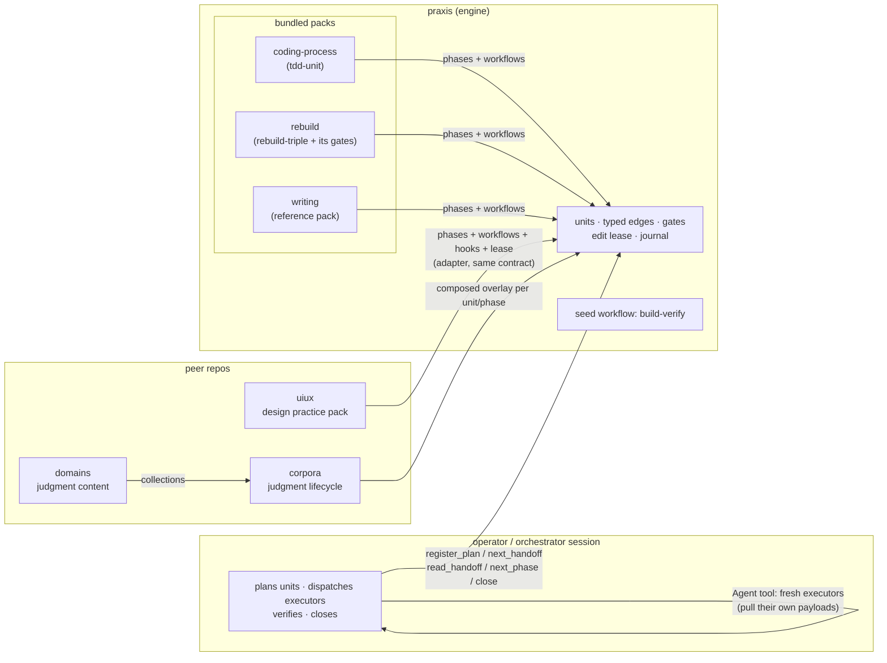
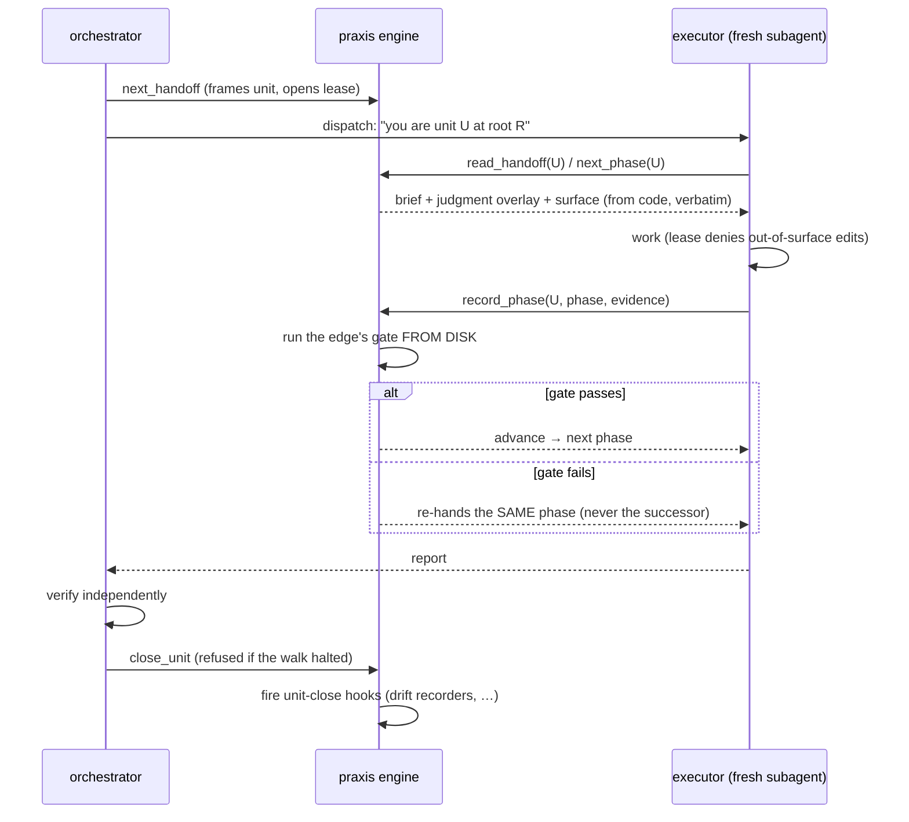
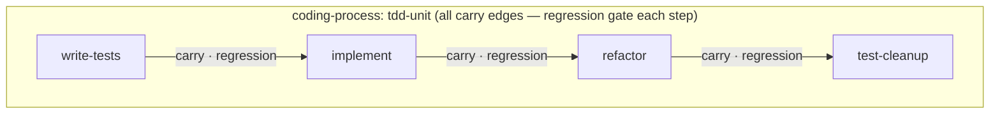
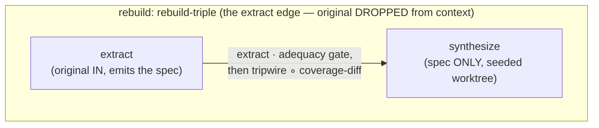
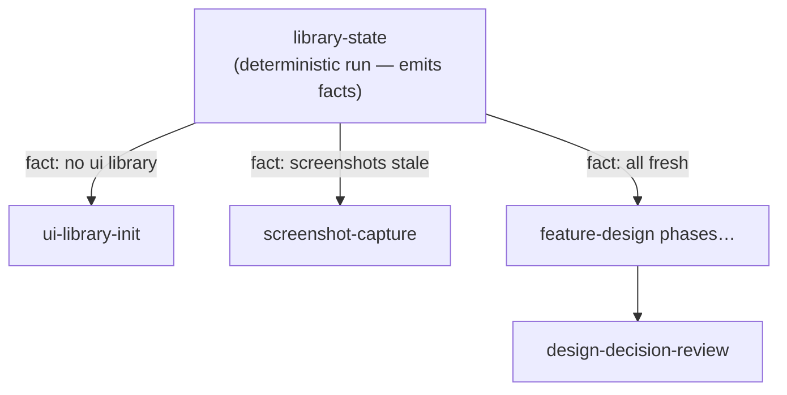

# Workflow packs — how practices run through praxis

*2026-08-13, written at the close of the restructuring arc (see `cut-plan-2026-08-12.md`
and the peer repos' cut plans). This is the mental model for what praxis became.*

"Rebuild" and "coding-process" are best understood as **workflow packs**: bundles of
process vocabulary that run *through* the engine. Praxis itself knows nothing about
TDD, rebuilds, or design — it knows units, phases, typed edges, gates, the lease, and
the journal. A pack teaches a root a way of working; the engine referees it.

A pack may carry any subset of the contributor contract:

| slot | what it adds | example |
|---|---|---|
| `phases()` | named moves | `write-tests`, `extract`, `library-state` |
| `workflows()` | a typed-edge graph over those phases | `tdd-unit`, `rebuild-triple`, `design-sync` |
| `Workflow.verifiers` | the gates' *form* for that workflow | tripwire ∘ coverage-diff at synthesize-exit |
| `contribute()` | per-phase context (keyed on `phase_name`) | uiux's graduated disclosure |
| `hooks()` | react at `unit-close` | uiux's drift/staleness recorder |
| `surface()` | the edit lease | uiux's docs-only design lease |

Judgment is deliberately NOT in the pack — it lives in the domains bucket and arrives
through corpora, composed by subject/shape/task-kind regardless of which workflow (or
none) a unit walks. Process and judgment are orthogonal axes.

## The ecosystem

## Anatomy of a unit's walk

## Two packs, two edge disciplines

The edge type decides what is in context and which gate compensates: carry keeps the
original and asks "didn't break?"; extract drops it and pays with coverage-diff +
the copy-detection tripwire. That theory is core; each pack is one application of it.

## Adding your own practice — a design workflow, or anything else

uiux is the existence proof: a peer repo whose adapter contributes `design-bootstrap`,
`feature-design`, and `design-sync`, with a deterministic `library-state` phase routing
by **fact edges**:

To add a practice, you need exactly one module with `PRAXIS_PLUGIN = True`, a `make(root)`,
and whatever slots you want — registered by one `module:factory` line. Three homes,
by maturity:

1. **project-local** — `<root>/.praxis/plugins/` — a pack for one repo, zero ceremony.
   The circuit-builder engine could carry a `simulation-verify` workflow no other
   project ever sees.
2. **peer repo** — the corpora/uiux pattern, when a practice deserves its own life,
   discovered via `plugins_search_paths` or the global layer.
3. **bundled** — praxis's own `plugins/`, reserved for process vocabulary with no life
   outside the engine.

What this opens up (each is a pack, not an engine change):

- **migration**: expand → migrate-batch × N → contract, with a gate that refuses
  contract until every batch verified (the planning judgment already names this shape).
- **release-readiness**: a checklist of deterministic phases (build, licenses,
  changelog, smoke) whose gates are commands.
- **incident/debug**: reproduce → bisect → fix → regression-test, where the
  reproduce phase's gate refuses to advance until the failure is demonstrated.
- **reading** (corpora's pipeline as a walk): queue → fetch (gate: real text or
  fetch-failed) → mine → deposit.
- **per-root gate forms**: any workflow can carry its own `verifiers` factory — a
  root's pack can gate `implement` on its own typecheck + contract suite without
  touching core.

The invariant that makes all of this safe to open: **packs add vocabulary and gates;
they cannot weaken the engine.** Close is only reachable through passed gates, the
lease only widens by framing a unit, and the journal records every step regardless of
whose vocabulary the unit walked.

## Forging a pack

`skills/forge-workflow` is how a practice becomes a pack: it mines the process from a lived
session, an external source, or a freeform idea, renders the honest verdict of whether it's even a
workflow (≥2 phases with typed transitions and a real gate — otherwise it's a skill, not a
workflow), and authors the module. `scripts/forge_check.py <module_path>` is the deterministic
gate before anything is registered — it validates every candidate phase/workflow against the
engine's own rules and dry-walks each workflow with stub evidence to a terminal, so a pack is
proven runnable before a real unit ever exercises it.
